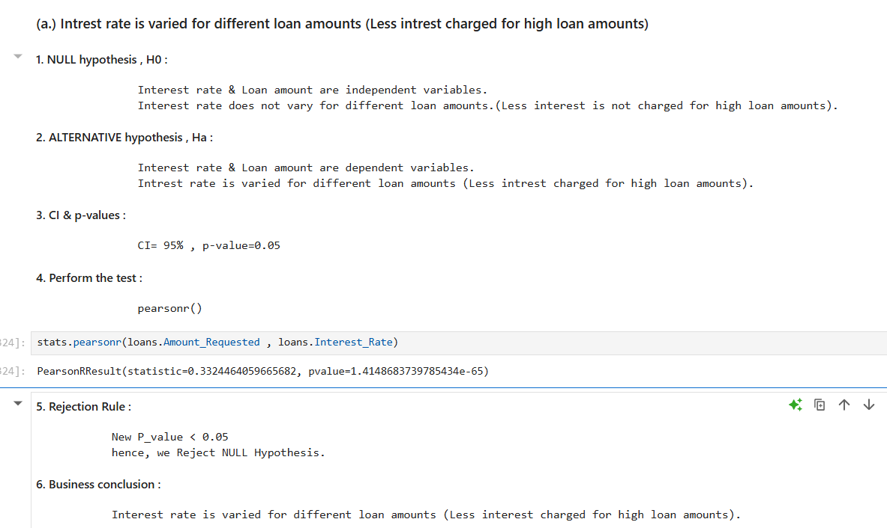
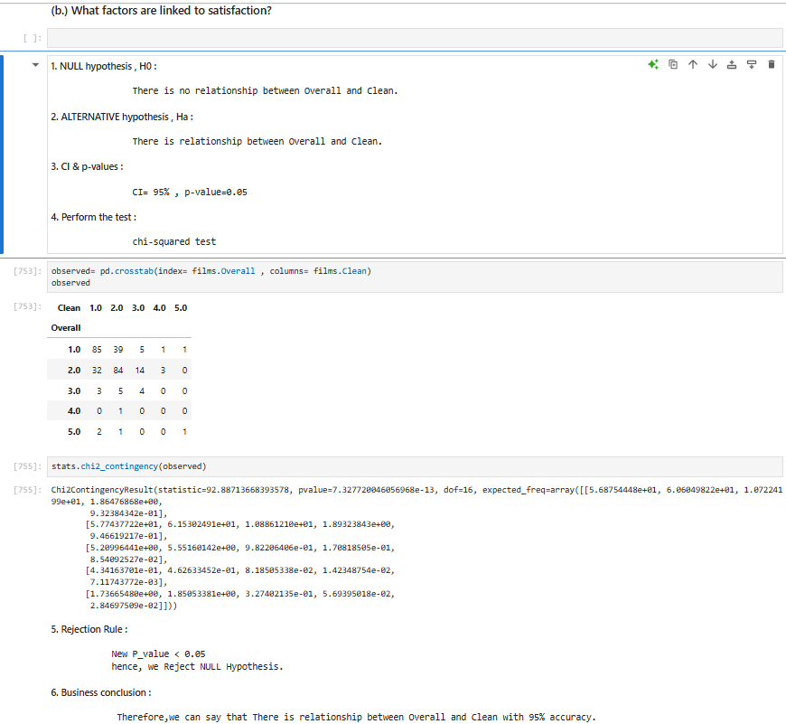
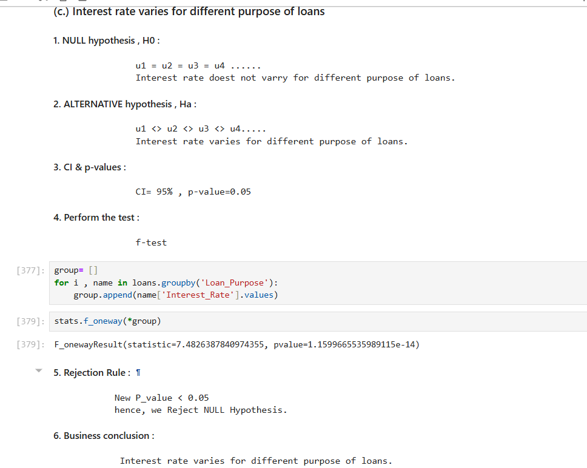

# 📊 Hypothesis Testing Case Study – Basic Statistics in Action

This project explores **statistical hypothesis testing** methods using real-world datasets. We apply common statistical techniques like **t-tests, ANOVA, and chi-square tests** to derive actionable insights for business decision-making.

---

## 🚀 Project Objectives

- Understand customer behavior, product sales, or treatment outcomes using statistical tests.
- Apply and interpret **t-tests**, **ANOVA**, and **Chi-square tests**.
- Translate statistical findings into **data-driven business strategies**.

---
## 📁 Datasets Used

- `LoansData.csv` – Customer loan applications and outcomes
- `Films.csv` – Movie production, genres, and performance data
- `Price_Quotes.csv` – Vendor pricing quotes
- `Priority_Assessment.csv` – Ratings and priority categorizations
- `Treatment_Facility.csv` – Health/treatment-related facility data

---


## 🗂️ Project Structure

```
Hypothesis-Testing-Case-Study/
│
├── Hypothesis Testing Case Study.ipynb    # Main analysis notebook
├── LoansData.csv
├── Films.csv
├── Price_Quotes.csv
├── Priority_Assessment.csv
├── Treatment_Facility.csv
├── outputs/
│   └── plots/                             # Visuals generated from the notebook
├── README.md
├── LICENSE
└── requirements.txt                       # (You can auto-generate this using pip freeze)


```
---

## 🧪 Techniques Used

- ✅ **One-sample t-test**: Compare sample mean to a known value.
- ✅ **Two-sample t-test**: Compare means of two independent groups.
- ✅ **Paired t-test**: Analyze before-and-after effects in the same group.
- ✅ **ANOVA (Analysis of Variance)**: Test differences among multiple groups.
- ✅ **Chi-square Test**: Examine relationships between categorical variables.

---

## 📈 Insights & Interpretations

- **T-tests** helped validate whether customer average spending differed by gender.
- **ANOVA** showed if spending habits varied across different age groups.
- **Chi-square tests** uncovered associations between payment methods and purchase categories.

Each test is accompanied by visualizations (boxplots, bar charts) and business-friendly explanations.

---

## 📌 Business Impact

- 🧠 Provided statistical backing for marketing and customer segmentation.
- 📉 Reduced bias in business decisions by backing them with statistical significance.
- 🎯 Helped identify areas where operational or sales strategies could be improved.

---

## 🛠️ Tools & Technologies Used

- Python 🐍
- Pandas 🐼
- SciPy 📊
- Matplotlib 📉
- Seaborn 🌈
- Jupyter Notebook 📓

---

## 📈 Visual Outputs

To include visual proof of your results, save a screenshot and place it in an `outputs/` folder:







---
## 📌 Author

**Abhishek Bhardwaj** 
  
[LinkedIn](https://www.linkedin.com/in/abhishekbhardwaj28)
[GitHub](https://github.com/abhishek-9617)
